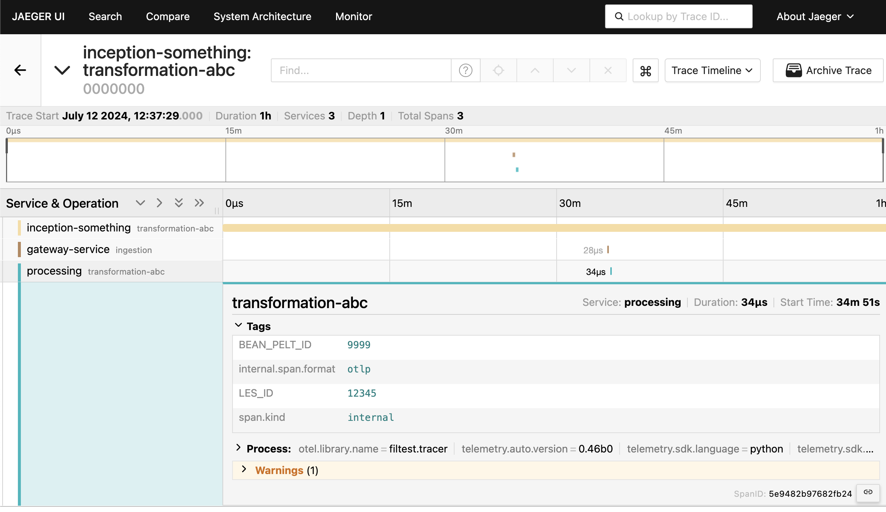

# opentel-playground
1. create venv

`python -m venv ./`

2. activate venv (macos/linux)

`source ./bin/activate`

3. install requerements

`pip install -r requirements.txt`

4. deploy jaeger to azure kubernetes - these are likely incomplete and they assume you already have a kubernetes cluster in azure, but this should be helpful anyway

`az login`

`az account set --subscription [YOUR SUBSCRIPTION]`

`sudo az aks install-cli`

`az aks get-credentials --resource-group [YOUR RG] --name [YOUR ]`

`kubectl create namespace observability`

`kubectl apply -f https://github.com/cert-manager/cert-manager/releases/download/v1.15.1/cert-manager.yaml -n observability`

`kubectl create -f https://github.com/jaegertracing/jaeger-operator/releases/download/v1.57.0/jaeger-operator.yaml -n observability`

`kubectl apply -f simplest.yaml`

`kubectl patch service simplest-collector -p '{"spec": {"type": "LoadBalancer"}}'`

`kubectl patch service simplest-query -p '{"spec": {"type": "LoadBalancer"}}'`

wait a few secs and check the external ip

`kubectl get services `

UI port: 16686
Collector-port: 4318

5. replace the ip of the collector in main.py

6. check out the help command

`python main.py -h`

7. run a few examples, like

`python main.py --serviceName=gateway-service --spanName=ingestion`

decide on a unique tracing id eg 1234

`python main.py --serviceName=gateway-service --spanName=ingestion --parentTraceId=1234`

`python main.py --serviceName=processing --spanName=transformation-abc --tags="LES_ID=12345,BEAN_PELT_ID=9999" --parentTraceId=1234`

(refresh the span details page)

`python main.py --serviceName=inception-something --spanName=transformation-abc --tags="LES_ID=12345,BEAN_PELT_ID=9999" --parentTraceId=1234 --startTime=1720780649000000000 --endTime=1720784249000000000` 

(these will likely be way in the past (2024-07-12))

8. expecting to see something like this

ZZZ. after you're done with the demo, scale to 0 replicas or remove the namespace completely
`kubectl scale --replicas=0 deployment/simplest`
